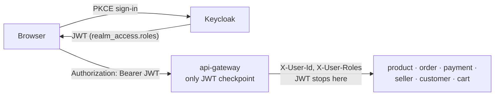
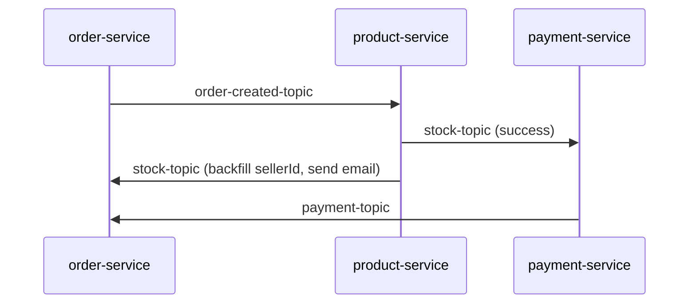
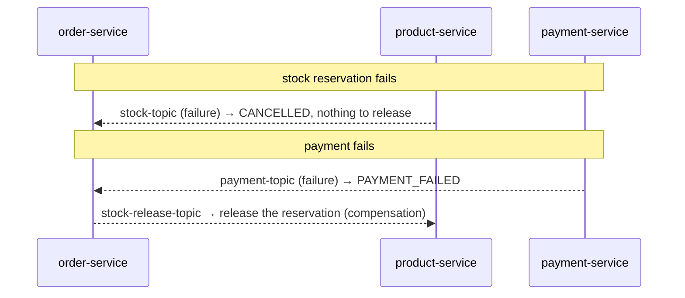

# Architecture & System Design

This is the design narrative for Cloth Shop: why it's built the way it is, not just
what's in it. [CLAUDE.md](CLAUDE.md) is the terse reference for working in this
codebase day-to-day; [PLAN.md](PLAN.md) is the phase-by-phase build log with every
real bug found along the way. This document is the story in between — read top to
bottom for the reasoning, or jump to a section for a specific concern.

**Contents:** [Requirements](#requirements) · [Architecture](#architecture) ·
[Data](#data) · [Failure](#failure) · [Security](#security) · [Testing](#testing) ·
[Observability](#observability) · [Deployment](#deployment) · [Operations](#operations)

---

## Requirements

### Functional

Three actors, one identity system — a customer, a seller, and an admin are all just
Keycloak users distinguished by a realm role, not separate account types:

| Actor | Can do |
|---|---|
| **Customer** (default role) | Browse/search the catalog, view a product's variants, add to cart, check out, view their own order history, request a refund, leave a review on a product they actually bought |
| **Seller** (granted after admin approval) | Everything a customer can, plus: list/edit/delete their own products, upload product photos, fulfill their own order lines (ship/deliver), view their own payout ledger, onboard to Stripe Connect |
| **Admin** (provisioned manually) | Manage categories, approve/suspend seller applications, view every order across every customer, everything else |

### Non-functional — the constraints that actually shaped the design

These are the requirements worth stating explicitly, because each one ruled out an
easier implementation:

- **No overselling under concurrent purchases.** Two customers buying the last unit
  of a variant at the same instant must not both succeed. → optimistic locking
  (`@Version` on `ProductVariant`) instead of a naive read-then-write.
- **No order left in an ambiguous state.** A created order must never look
  indistinguishable from a paid one. → a single `OrderStatus` enum with explicit
  transitions, not a scatter of booleans.
- **A retried checkout request must not double-charge or double-reserve stock.** →
  client-supplied `Idempotency-Key`, unique-constrained on `Order.idempotencyKey`.
- **A downstream service must not be able to forge identity by calling another
  service directly.** → the gateway strips any inbound `X-User-Id`/`X-User-Roles`
  before setting its own, so those headers can only ever originate from a validated
  JWT.
- **The system degrades, it doesn't crash, when a dependency is unreachable.**
  Reviews fail closed if order-service is down (see [Failure](#failure)); Stripe
  absence fails closed with a clear reason instead of faking success; the frontend
  shows a friendly message instead of a stack trace when the catalog fetch fails.
- **Cost and operational scope: Docker Compose / a single VM, not Kubernetes.** A
  stated target, not an unfinished migration — see [Deployment](#deployment).

### Explicitly out of scope

Stated up front rather than discovered by omission: multi-currency, real-time
alerting/paging, per-customer coupon usage limits, HTTPS/TLS on the free-tier demo
deployment, a shared library between services (each service keeps its own copy of
event DTOs on purpose — see [Data](#data)).

---

## Architecture

Ten independently deployable Spring Boot services behind one API gateway, plus a
Next.js storefront. No aggregator POM — each service has its own `pom.xml`, is
versioned independently, and ships its own Docker image.

| Service | Role | Store |
|---|---|---|
| `api-gateway` | Entry point: JWT validation, routing, CORS, rate limiting, circuit breaking | Redis (rate limiter) |
| `discovery-service` / `config-server` | Eureka registry / centralized config | — |
| `customer-service` | Customers + addresses | MongoDB |
| `product-service` | Catalog: products, variants, categories, images, reviews | Postgres |
| `seller-service` | Seller identity, Stripe Connect onboarding | Postgres |
| `order-service` | Order + order-line orchestration, the saga's orchestrator, coupons | Postgres |
| `payment-service` | Stripe charges, refunds, seller payout ledger | Postgres |
| `cart-service` | Shopping cart | Redis |
| `notification-service` | Order/payment confirmation emails | MongoDB |
| `frontend` | Next.js storefront — the only client of `api-gateway` | — |

### The one trust boundary

The gateway is the **only** place a JWT is ever validated. Every service behind it
has zero Spring Security dependency at all — they authorize purely off
`X-User-Id`/`X-User-Roles` headers the gateway forwards, which is what lets 9
services skip re-implementing OAuth2 resource-server config entirely. The tradeoff
is that every one of them has to trust the gateway completely — which is exactly
why `UserContextGatewayFilter` strips those two headers from any *inbound* request
before setting its own values from the validated token.

Real bug this caught: `exchange.getPrincipal()` doesn't reliably return the
authenticated principal inside a Spring Cloud Gateway `GlobalFilter`, even on a
fully-authenticated request — it read empty every time in testing.
`ReactiveSecurityContextHolder.getContext().map(SecurityContext::getAuthentication)`
is what actually works, backed by the Reactor `Context` Spring Security writes the
authentication into.

### Checkout saga

Kafka choreography, not a single orchestrator process — `order-service` publishes
an event, `product-service` reacts and publishes its own, `payment-service` reacts
to that, `order-service` reacts to the result. Correlated by `orderReference` (a
string), deliberately not the numeric order id, since that field is technically
client-suppliable on the request and so can't be trusted as a correlation key.

The failure and compensation branches are covered in [Failure](#failure) — that's
where the interesting engineering is.

---

## Data

No shared database, no cross-service foreign keys. `Order.customerId`,
`Product.sellerId`, `OrderLine.sellerId` are all plain Keycloak-subject strings —
each service resolves the *identifier*, never joins across a service boundary at
the database level.

| Service | Store | Owns |
|---|---|---|
| `product-service` | Postgres | `Product`, `ProductVariant` (the actual stock-tracked unit, optimistic-locked), `Category`, `ProductImage`, `Review` |
| `order-service` | Postgres | `Order`, `OrderLine`, `Coupon` |
| `payment-service` | Postgres | `Payment`, `SellerPayout` (one ledger row per seller per order) |
| `seller-service` | Postgres | `Seller` |
| `customer-service` | MongoDB | `Customer` + embedded address |
| `notification-service` | MongoDB | Sent-notification records |
| `cart-service` | Redis | `cart:{userId}` hash, `variantId → qty`, no other persistence |

### Consistency model

No distributed transactions, no two-phase commit. Each service's own database is
the single source of truth for its own aggregate; cross-service state gets to
*eventual* consistency via the Kafka saga, not immediate consistency via a
coordinated write. The one deliberate exception to "no synchronous cross-service
calls" is customer validation at order-creation time (`order-service`'s
`CustomerClient`, a Feign call) and a customer/admin-triggered refund (needs an
immediate success/fail response, unlike checkout).

A genuinely interesting ordering problem this created: `OrderLine` rows are
persisted *before* any seller is known (order-service only has `{variantId,
quantity}` at request time). `OrderLine.sellerId` gets backfilled asynchronously,
once `product-service` resolves the variant during stock reservation and echoes
the seller id forward on the `stock-topic` event.

### Known data-model debt, stated rather than hidden

`product-service` ships Flyway migrations (`V1`/`V2`) that predate the
`ProductVariant`/`sellerId`/`Category`/`ProductImage` schema entirely — every
schema change since has relied on Hibernate `ddl-auto: update` instead, with
`spring.flyway.enabled: false` locally. Reconciling the migration history is real,
scoped-out work, not an oversight nobody noticed.

---

## Failure

This is the section most portfolio projects skip — the happy path is the easy 80%.

### The saga's two failure branches

A failed stock reservation cancels cleanly — nothing was ever actually reserved, so
there's nothing to compensate. A failed payment cancels *and* releases the
reservation, reusing the exact same `stock-release-topic` consumer a customer/admin
refund also uses — one compensation code path for two different triggers, not two.

### Gateway-level resilience

`api-gateway` wraps every downstream call in a Resilience4j circuit breaker (50%
failure-rate threshold trips it, 10s wait before half-open) plus a retry (3
attempts, **GET only** — deliberately excluded on mutating requests, since retrying
a non-idempotent POST could double-submit it) plus connect/response timeouts.

### Fail-closed, not fail-open, on every external dependency

| Dependency unreachable | What happens |
|---|---|
| Stripe (no `STRIPE_SECRET_KEY` configured) | Charges fail with an explicit reason, never fake-succeed |
| `order-service` (during a review's verified-purchase check) | Review creation is rejected — an outage can never manufacture fake social proof |
| MinIO (down at product-service startup) | Service still boots; a warning is logged; image features degrade rather than the whole service failing to start |
| Product-service's own catalog fetch (frontend) | Homepage shows "couldn't load the catalog right now," not a stack trace |

### At-least-once delivery, no consumer-side dedup yet

A stated, real risk, not a hidden one: Kafka's at-least-once semantics mean a
redelivered message could in theory double-reserve stock or double-charge a card.
No idempotency key exists on the consumer side yet — flagged in `PLAN.md` as future
work, not discovered by an incident.

### Real incidents hit during this build

- **`api-gateway` was 401-rejecting Prometheus's own scrape** of its own
  `/actuator/prometheus` endpoint — the security config's `anyExchange()
  .authenticated()` catch-all applies to the gateway's *own* local endpoints, not
  just proxied traffic. Fixed with an explicit `permitAll()` matcher ahead of the
  catch-all, confirmed live (401 → 200).
- **`Payment.stripePaymentIntentId` was never persisted**, despite the Stripe
  charge result always carrying it — meaning a refund would have had nothing to
  refund *against*. Found while building the refund feature, before it shipped.
- **Kafka failed to rejoin Zookeeper after a Docker Desktop crash** —
  `org.apache.zookeeper.KeeperException$NodeExistsException`, a stale ephemeral
  broker-registration znode from before the crash. A plain restart wasn't enough;
  fixed with `docker compose up -d --force-recreate zookeeper kafka`.
- **The gateway's circuit breaker fired a false-positive fallback on a slow-but-
  successful call** — a seller-registration request actually succeeded on the
  backend, but a response-time race tripped the breaker before the client saw the
  real `200`. Caught by the follow-up request returning `409 "profile already
  exists"` instead of the expected success — which is what revealed the request
  had, in fact, already landed.

---

## Security

- **Trust boundary**: covered in [Architecture](#architecture) — the gateway is the
  only JWT validator in the system.
- **RBAC**: three realm roles (`customer`/`seller`/`admin`) unpacked from
  Keycloak's `realm_access.roles` claim via a custom `JwtAuthenticationConverter` —
  Spring Security has no built-in support for Keycloak's nested roles claim, so the
  default converter silently finds nothing without this.
- **Defense in depth beyond the gateway's role gate**: product/order-line mutations
  are *also* ownership-checked at the service layer (caller's id must match
  `sellerId`, or the caller is an admin) — the gateway proves *a* seller is
  calling, the service proves *this* seller owns *this* resource.
- **Route-matcher ordering is a real attack surface, not just a bug class**: a
  broad `DELETE /api/v1/products/**` rule (meant for deleting a product) would have
  silently also gated `DELETE /api/v1/products/{id}/reviews/{reviewId}` (deleting
  your own review) to sellers/admins only — found and fixed with a more specific
  matcher ordered ahead of it.
- **Stripe webhooks are signature-verified, not JWT-authenticated** — Stripe calls
  that endpoint directly, so `Webhook.constructEvent` is the actual authentication
  mechanism, not a bearer token.
- **Image bytes never transit application servers.** Product photo uploads use
  presigned MinIO PUT URLs — the browser uploads straight to object storage,
  shrinking both the attack surface and the compute cost of `product-service`.
- **PKCE for the public frontend client** — no client secret ships to the browser;
  `nextjs-storefront` is a public client with `token_endpoint_auth_method: none`.
- **Secrets are centralized and gitignored, not scattered.** Every credential
  across the stack is documented in root `.env.example`; a root `.gitignore`
  (added when this was audited) keeps a real `.env` out of version control.
- **An honest, unresolved item, left visible rather than buried**: `config-server`
  previously had a live GitHub PAT hardcoded in `application.yml`. It now reads
  `${GITHUB_TOKEN}` instead, but the *old* token is still in this repo's git
  history and needs revoking on GitHub — that part isn't fixable from inside the
  repo, and `CLAUDE.md` says so rather than pretending it's resolved.
- **Known gap in the free-tier live deployment**: HTTP, not HTTPS — no domain, no
  cert. Scoped explicitly as a demo limitation; Stripe stays in test mode there.

---

## Testing

Three layers, deliberately not collapsed into one:

| Layer | What | Why |
|---|---|---|
| **Unit** (JUnit + Mockito) | Every service: mapper tests, service-impl tests, one context-load test | Fast, runs on every save, covers edge cases (failure paths, backward-transition guards) that don't need real infra |
| **Integration** (Testcontainers) | `order-service`'s saga-critical `@KafkaListener` wiring — real Postgres 16 + real Kafka, the actual listener beans, real JSON (de)serialization, real DB transactions | Proves the wiring between consumers actually works, which a mocked unit test **structurally cannot** — this is the layer that would have caught a serialization mismatch or a misconfigured consumer group |
| **End-to-end** (Playwright) | Anonymous golden paths (catalog, search, PDP) live-verified; authenticated golden paths (checkout, seller fulfillment) written and gated behind seeded test credentials | Browser-level proof the auth gates and UI flows actually work, not just the API |

**A stated scope decision, not a gap that was missed**: Testcontainers coverage is
one service, not all three the saga touches. `order-service` is the saga's
orchestrator, so it's where the pattern was proven first — the same
`@DynamicPropertySource` (real Postgres/Kafka) + `@MockitoBean` (the one
synchronous cross-service dependency) approach transfers directly to
`product-service`/`payment-service` if extended.

**CI trusts nothing it can't inspect**: every service's Jenkinsfile now runs an
explicit `mvn -B verify` stage *before* the shared build-and-push step, because
that step is an external shared library whose own test-running behavior isn't
visible from this repo. If tests fail, the pipeline fails regardless of what the
shared step would have done on its own.

---

## Observability

`micrometer-registry-prometheus` on every service, `/actuator/prometheus` exposed,
scraped by Prometheus, visualized in a provisioned Grafana dashboard. Zipkin traces
a request across service boundaries. `kafka-exporter` surfaces consumer lag per
group.

**Two hand-instrumented business metrics, not just auto-instrumented HTTP/JVM
noise** — placed at the saga's actual decision points, because "is the HTTP layer
healthy" and "is the saga healthy" are different questions:

- `stock_reservation_total{result}` — in `product-service`'s `OrderCreatedConsumer`:
  does checkout actually reserve stock, or lose to a stockout/optimistic-lock race?
- `payment_charge_total{result}` — in `payment-service`'s `StockReservationConsumer`:
  does a reserved-stock order actually charge successfully, or fail at Stripe?

Both are tagged by outcome (`result=success|failure`) rather than split into
separate counter names, so Grafana graphs success-vs-failure as one series group
instead of two metrics a dashboard author has to remember to pair up.

**A stated non-goal**: no Alertmanager, no paging. This stack is wired for
dashboards and exploration, not on-call — a deliberate scope line, since alerting
thresholds that mean anything require production traffic patterns this project
doesn't have.

MailDev catches every email the saga sends in development, so "did the
confirmation email actually fire" is answerable without a real SMTP provider.

---

## Deployment

**Local development**: infra (Postgres, MongoDB, Kafka, Redis, Keycloak, MinIO,
Prometheus, Grafana) runs via `docker-compose.yml`; the 10 Spring Boot services run
as host processes (`mvn spring-boot:run`), not containers — faster iteration, no
image rebuild per code change.

**CI**: per-service Jenkinsfiles run `mvn verify` then delegate to a shared
`buildService(...)` step; a new `frontend/Jenkinsfile` runs lint → type-check →
build → Playwright smoke.

**Live deployment**: `docker-compose.prod.yml` fully containerizes everything —
all 10 backend services, the frontend (multi-stage Dockerfile, Next.js
`standalone` output), and infra — wired together by Docker service name instead of
`localhost`, targeting a free-tier Oracle Cloud ARM VM. Real adaptation work this
required, not a drop-in copy of local config:

- Confluent's `cp-kafka`/`cp-zookeeper` images are **amd64-only** and fail to pull
  on ARM — swapped to Bitnami's images, which publish `arm64` builds.
- MinIO's presigned upload URLs are generated from the *client's own configured
  endpoint* (not a separate "public URL" setting) — so the endpoint itself has to
  be the VM's public address, or a browser can't use the upload link it's handed.
- Keycloak's issuer (`KC_HOSTNAME`) has to match the gateway's `issuer-uri`
  exactly, or JWT validation fails with "invalid issuer" — both are driven from the
  same `DEPLOY_HOST` value so they can't drift apart.
- The gateway's route table (normally sourced from an external config repo not
  present in this working directory) is expressed via Spring's indexed
  environment-variable binding directly in the compose file instead.

**A stated scope decision**: Docker Compose / a single VM is the deployment
target, not Kubernetes. Observability and secrets tooling are scoped to that,
consistent with treating this as a real but appropriately-sized system rather than
over-engineering for a scale this project doesn't have.

---

## Operations

**Bringing the stack up**: `docker compose up -d` for local infra;
`docker compose -f docker-compose.prod.yml --env-file .env.prod up -d --build` for
the live VM — see `DEPLOY.md` for the full runbook, including the one-time Keycloak
realm/client provisioning a fresh deployment needs.

**Where to look when something's wrong**:

| Symptom | Check |
|---|---|
| A request behaves oddly across services | Zipkin (`:9411`) — trace it end to end |
| "Is the saga actually healthy right now?" | Grafana's saga health funnel panel |
| "Did that email actually send?" | MailDev (`:10081`) |
| A specific service | `docker compose logs -f <service>` |

**Known environment gotchas, documented because they were actually hit, not
anticipated**:

- Windows Hyper-V reserves TCP port ranges Docker silently can't bind (port
  `3001` was one of them — Grafana moved to `4000`).
- Keycloak's `admin-cli` client issues near-empty tokens for manual testing (no
  `sub`, no `realm_access`) — a client with the default full scope set is needed
  instead, or you'll chase a phantom "missing X-User-Id" bug that's actually just a
  bad test token.
- `npx playwright install` downloads its browser binary from a CDN, not npm — if
  that's blocked or throttled on a given network, e2e specs still type-check and
  lint clean, they just can't execute until the binary lands another way. (This is
  also why the frontend's production Docker image installs dependencies with
  `--ignore-scripts` — Playwright's postinstall hook would otherwise try, and
  stall, the image build itself.)

**Startup order matters locally**: Postgres/MongoDB/Kafka/Redis before any service
that depends on them; `config-server` → `discovery-service` first if you're running
them at all (both are `optional:` dependencies every other service tolerates
missing).
