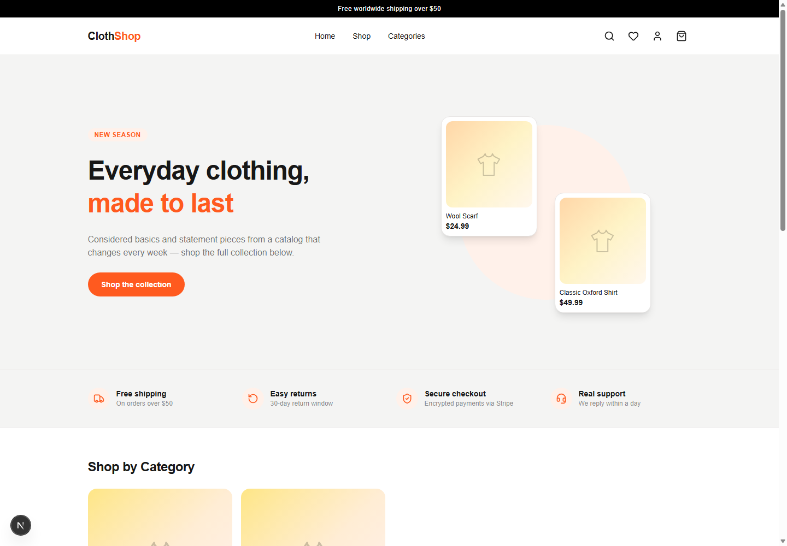
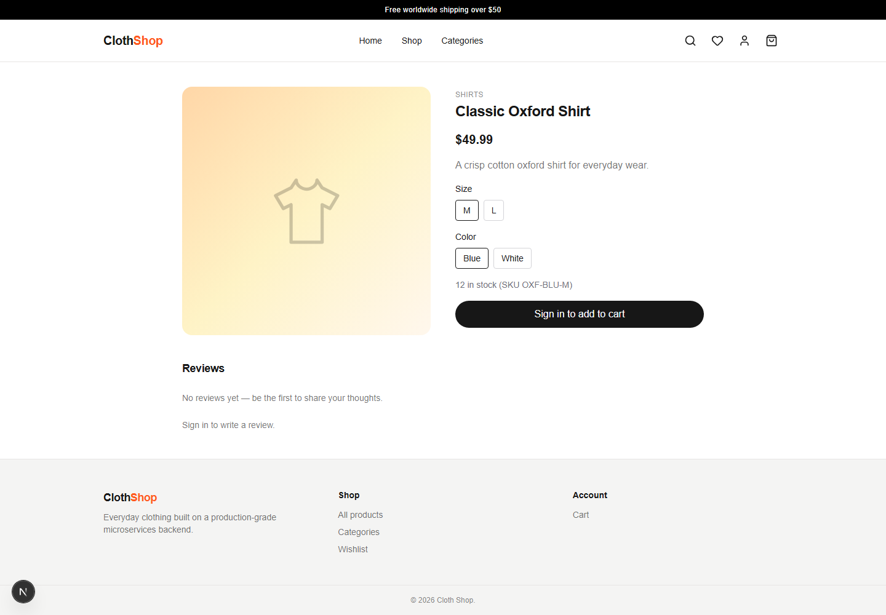
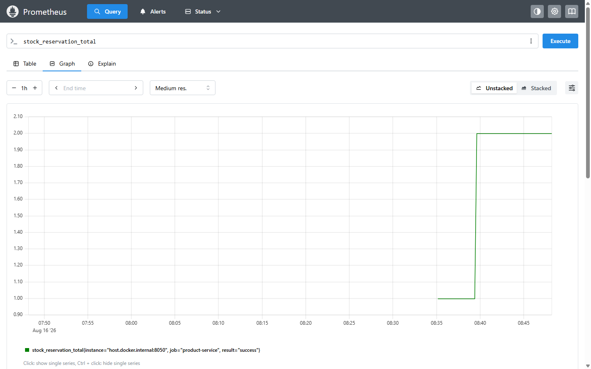
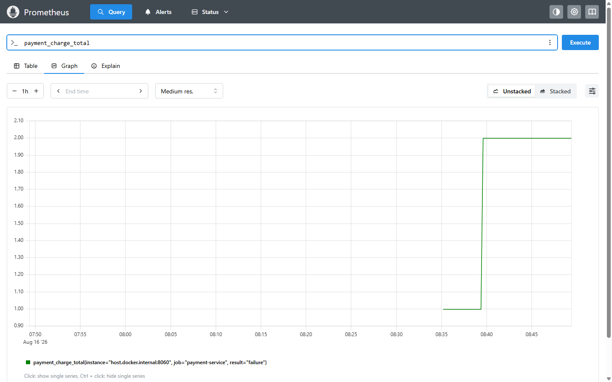

# Cloth Shop — Multi-Vendor E-Commerce Platform

A multi-vendor clothing marketplace: ten independently deployable Spring Boot
services behind one API gateway, a Next.js storefront, and a checkout that's an
actual asynchronous saga over Kafka — an order is created, stock is reserved,
payment is charged via Stripe, and every failure path compensates cleanly (cancel
the order, release reserved stock) instead of leaving things half-done.

**→ [Read the full system design](ARCHITECTURE.md)** — requirements, architecture,
data ownership, failure modes (including the real incidents found while building
this), security model, testing strategy, observability, and deployment, in one
document with diagrams.

For the terse day-to-day reference (endpoints, gotchas, package layout), see
[CLAUDE.md](CLAUDE.md). For the phase-by-phase build log — what shipped, what was
deliberately deferred and why — see [PLAN.md](PLAN.md). For a prep sheet on
defending the design decisions below in an interview, see
[INTERVIEW_PREP.md](INTERVIEW_PREP.md).

## Screenshots

The storefront, and the checkout saga's business metrics, captured from the
actually-running stack — not mockups.

<table>
<tr>
<td width="50%">

**Storefront**


</td>
<td width="50%">

**Product detail page**


</td>
</tr>
<tr>
<td width="50%">

**`stock_reservation_total` — a real checkout reserving stock**


</td>
<td width="50%">

**`payment_charge_total` — Stripe failing closed (no key configured)**


</td>
</tr>
</table>

The two metrics panels are from a real order that ran through the full Kafka
saga during this screenshot session: stock reservation succeeded, then the
charge failed closed exactly as designed (no `STRIPE_SECRET_KEY` configured —
see [ARCHITECTURE.md](ARCHITECTURE.md#failure)), and the failure triggered the
saga's compensation path to release the reservation. Not staged data.

## Architecture at a glance

| Service | Role | Store |
|---|---|---|
| `api-gateway` | Entry point: JWT validation, routing, CORS, rate limiting, circuit breaking | Redis (rate limiter) |
| `discovery-service` | Eureka registry | — |
| `config-server` | Centralized config (git-backed) | — |
| `customer-service` | Customers + addresses | MongoDB |
| `product-service` | Catalog: products, variants, categories, images, reviews | Postgres |
| `seller-service` | Seller identity, Stripe Connect onboarding & payouts | Postgres |
| `cart-service` | Shopping cart | Redis |
| `order-service` | Order orchestration, the checkout saga, coupons | Postgres |
| `payment-service` | Stripe charges, refunds, seller payout ledger | Postgres |
| `notification-service` | Order/payment confirmation emails | MongoDB |
| `frontend` | Next.js storefront (the only client of `api-gateway`) | — |

Identity is Keycloak (OAuth2/OIDC, three roles: customer/seller/admin); tracing is
Zipkin; metrics are Prometheus + Grafana with custom business counters at the
saga's actual decision points; local infra runs via `docker-compose.yml`. See
[ARCHITECTURE.md](ARCHITECTURE.md) for the trust-boundary and saga diagrams.

## Prerequisites

See [REQUIREMENTS.txt](REQUIREMENTS.txt) for exact tool/library versions. In
short: JDK 21, Maven, Node.js 20+, Docker & Docker Compose.

## Quick start

```bash
# 1. Start local infrastructure (Postgres, MongoDB, Kafka, Redis, Keycloak,
#    MinIO, Prometheus, Grafana, MailDev, Zipkin)
docker compose up -d

# 2. Provision Keycloak (one-time, needs Keycloak up first)
cd keycloak
./setup-realm-roles.sh
./setup-nextjs-client.sh
./setup-seller-service-client.sh
cd ..

# 3. Start the backend services, each in its own terminal, from services/<name>/
#    discovery-service/config-server are optional — everything else tolerates
#    them being absent (see CLAUDE.md).
cd services/customer-service && mvn spring-boot:run
cd services/product-service && mvn spring-boot:run
cd services/seller-service && mvn spring-boot:run
cd services/order-service && mvn spring-boot:run
cd services/payment-service && mvn spring-boot:run
cd services/notification-service && mvn spring-boot:run
cd services/cart-service && mvn spring-boot:run
cd services/api-gateway && mvn spring-boot:run

# 4. Start the frontend
cd frontend
cp .env.local.example .env.local   # fill in AUTH_SECRET (npx auth secret), etc.
npm install
npm run dev
```

The frontend runs at `http://localhost:3000`, api-gateway at
`http://localhost:8222`, Grafana at `http://localhost:4000`.

For a fully containerized deployment (all 10 services + infra as Docker
containers, e.g. for a cloud VM) see [DEPLOY.md](DEPLOY.md) and
`docker-compose.prod.yml` instead.

## Repository layout

```
services/                 10 independent Maven projects (one Spring Boot app
                           each, no parent POM)
frontend/                 Next.js 16 app (App Router, TypeScript, Tailwind)
keycloak/                 Keycloak Admin API scripts (realm/role/client provisioning)
monitoring/                Prometheus scrape config + provisioned Grafana dashboard
docker-compose.yml          Local dev infrastructure
docker-compose.prod.yml     Fully containerized deployment (all services + infra)
ARCHITECTURE.md             System design: requirements → architecture → data →
                            failure → security → testing → observability →
                            deployment → operations
CLAUDE.md                   Terse day-to-day reference and AI-assistant guide
PLAN.md                     Phase-by-phase build log — what shipped and why
DEPLOY.md                   Runbook for the containerized/cloud deployment
```

## Testing

- Backend unit tests: `mvn test` from inside each `services/<name>/` directory.
- Backend integration test (Testcontainers — real Postgres + Kafka, needs
  Docker running): `cd services/order-service && mvn verify`.
- Frontend: `npm run lint`, `npx tsc --noEmit`, and `npm run test:e2e`
  (Playwright — see [ARCHITECTURE.md](ARCHITECTURE.md#testing)) from inside
  `frontend/`.

## Status

The full marketplace is implemented end to end: multi-vendor catalog with
variants/images/reviews, Kafka checkout saga with compensation, Stripe payments
and Connect payouts, seller and admin dashboards, Prometheus/Grafana
observability, and a Testcontainers + Playwright test suite wired into CI. See
[PLAN.md](PLAN.md) for the full phase-by-phase history and every deliberate
simplification, and [ARCHITECTURE.md](ARCHITECTURE.md) for the reasoning behind
the major decisions.
